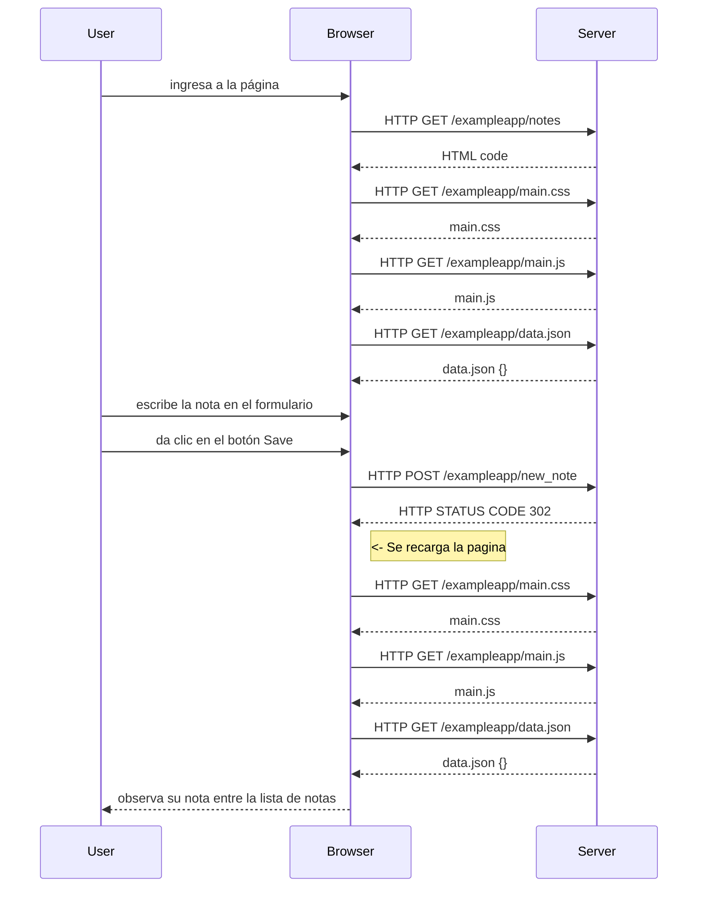

# FSO-part0
Entregables tareas Full Stack Open Parte#0

# Ejercicio 0.4 - Nuevo diagrama de nota

#Ejercicio 0.5 - Diagrama de aplicación de una sola página
```mermaid
sequenceDiagram
    %% Ejercicio 0.5: Acceso a la aplicación SPA
    participant User
    participant Browser
    participant Server

    User ->> Browser: Ingresa a la página SPA

    Browser ->> Server: HTTP GET /spa
    Server -->> Browser: HTML code

    Browser ->> Server: HTTP GET /main.css
    Server -->> Browser: main.css

    Browser ->> Server: HTTP GET /spa.js
    Server -->> Browser: spa.js

    Browser ->> Server: HTTP GET /data.json
    Server -->> Browser: data.json {}
    activate Browser

    Browser -->> User: Renderiza las notas en la página
    deactivate Browser


