```mermaid
sequenceDiagram
    %% Ejercicio 0.5: Acceso a la aplicación SPA
    participant User
    participant Browser
    participant Server

    User ->> Browser: Ingresa a la página SPA

    Browser ->> Server: HTTP GET /spa
    Server -->> Browser: HTML code

    Browser ->> Server: HTTP GET /main.css
    Server -->> Browser: main.css

    Browser ->> Server: HTTP GET /spa.js
    Server -->> Browser: spa.js

    Browser ->> Server: HTTP GET /data.json
    Server -->> Browser: data.json {}
    activate Browser

    Browser -->> User: Renderiza las notas en la página
    deactivate Browser
```

# 📌 FSO-part0  
**Entregables de las tareas de Full Stack Open - Parte 0**  

## 📒 Ejercicio 0.4 - Nuevo diagrama de nota  
Este diagrama ilustra el proceso de agregar una nueva nota en una aplicación tradicional, donde la página se recarga después de enviar la nota.  

## 游뇐jercicio 0.5 - Diagrama de aplicación de una sola página

## 游뇐jercicio 0.6 - Nueva nota en diagrama de aplicación de una sola pagina
```mermaid
sequenceDiagram
    participant User
    participant Browser
    participant Server

    %% Ejercicio 0.5: Acceso a la aplicación SPA
    User ->> Browser: Ingresa a la página SPA

    Browser ->> Server: HTTP GET /spa
    Server -->> Browser: HTML code

    Browser ->> Server: HTTP GET /main.css
    Server -->> Browser: main.css

    Browser ->> Server: HTTP GET /spa.js
    Server -->> Browser: spa.js

    Browser ->> Server: HTTP GET /data.json
    Server -->> Browser: data.json {}
    activate Browser

    Browser -->> User: Renderiza las notas en la página
    deactivate Browser

 
 %% Ejercicio 0.6: Creación de una nueva nota en la SPA
    User ->> Browser: Escribe la nota en el formulario
    User ->> Browser: Da clic en el botón enviar

    Browser -->> Browser: Previene la recarga de la página (e.preventDefault)
    Browser -->> Browser: Crea la nueva nota en memoria
    Browser -->> Browser: Redibuja la lista de notas

    Browser ->> Server: HTTP POST /new_note_spa
    Server -->> Browser: HTTP 201 Created

    Browser -->> User: Muestra la nueva nota en la lista sin recargar la página

